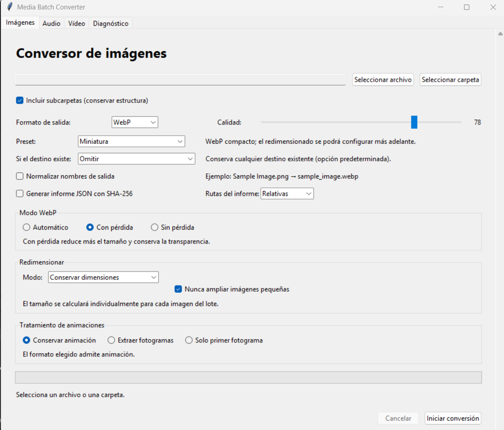
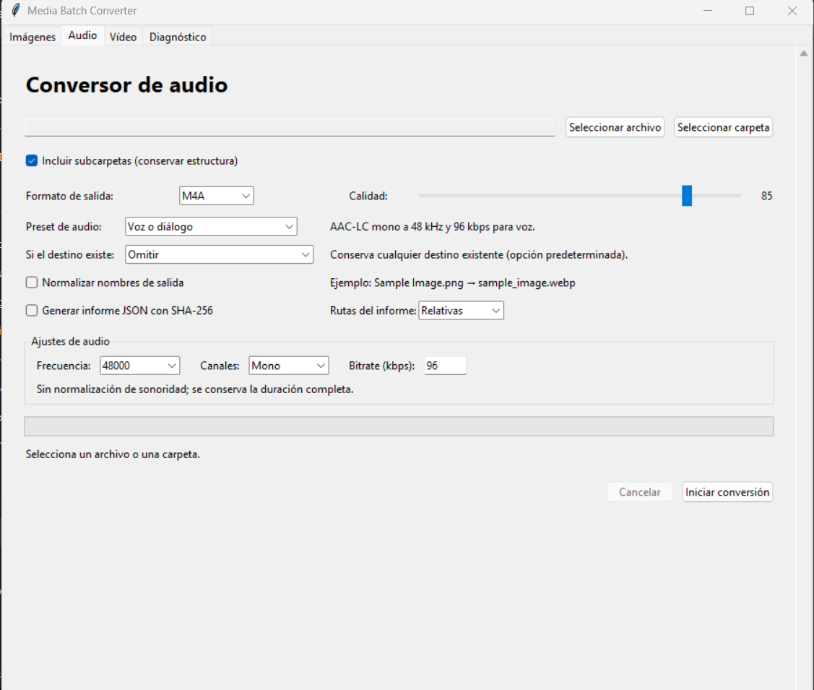
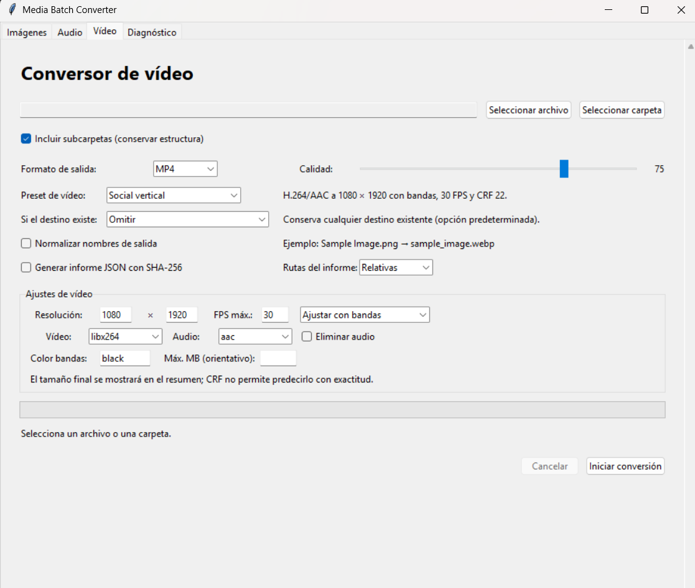

# Media Batch Converter

Desktop application for converting and optimizing images, audio, and video individually or in batches. It is built with Python, Tkinter, Pillow, and FFmpeg.

## Screenshots

### Image conversion



### Audio conversion



### Video conversion



## Features

- Convert one file or entire folders, with optional recursive discovery and preserved subfolder structure.
- Convert common image, audio, and video formats from separate tabs.
- Choose WebP automatic, lossy, or lossless encoding.
- Apply image, audio, and video presets, then refine settings manually.
- Resize images proportionally while preserving transparency where the destination supports alpha.
- Control video resolution, frame-rate limit, aspect handling, codecs, audio removal, and CRF quality.
- Choose how existing outputs are handled: skip, safe overwrite, unique name, or overwrite only when newer.
- Optionally normalize generated filenames without renaming originals.
- Generate privacy-aware JSON reports with chunked SHA-256 checksums.
- Preserve supported animations, extract frames, or explicitly keep only the first frame.
- Review validation warnings, progress, cancellation, and a final batch summary.
- Process everything locally. No media is uploaded.

## Supported formats

| Media | Input and output formats |
| --- | --- |
| Images | PNG, JPEG, WebP, BMP, TIFF, GIF |
| Audio | MP3, WAV, FLAC, OGG, M4A/AAC, Opus |
| Video | MP4, MKV, WebM, MOV, AVI |

Exact codec availability depends on the Pillow and FFmpeg builds in use. Transparency is retained for compatible image formats; JPEG uses a white background. Animated output is runtime-probed because codec support varies.

## Download and install on Windows

Download the ZIP attached to the relevant GitHub Release, verify its SHA-256 checksum, extract the complete folder, and run:

```text
MediaBatchConverter\MediaBatchConverter.exe
```

Keep the folder contents together: the executable uses the bundled FFmpeg and support files. Windows may show a reputation warning for an unsigned community build. Review the release source and checksum before running it.

No installer is currently provided. The application does not install dependencies or run `pip` automatically.

## Quick usage

1. Open the Images, Audio, or Video tab.
2. Select one file or a source folder.
3. For folders, choose whether to include subfolders.
4. Select an output format and preset or manual settings.
5. Choose the existing-file policy and optional report settings.
6. Start conversion and review the final summary.

Outputs are created beside the sources in a `convertidos_<format>` directory. Existing `converted_*` and `convertidos_*` directories and symbolic links are excluded from recursive discovery.

### Examples

- Convert a transparent PNG to WebP: Images → select file → WebP → Automatic → Start.
- Convert a recursive image tree: Images → select folder → keep Include subfolders enabled.
- Create an audio master: Audio → select source → WAV master preset.
- Create a compatible MP4: Video → select source → High quality 1080p preset.

## Image behavior

### WebP modes

- Automatic selects lossless for animations, palette images, and sampled images with at most 256 colors; it otherwise uses lossy encoding.
- Lossy uses the quality slider while retaining alpha support.
- Lossless preserves pixel values and ignores the quality slider.

### Resizing

Available modes preserve dimensions, limit width, limit height, fit within a box, or scale by percentage. Resizing uses LANCZOS after EXIF orientation, preserves aspect ratio and transparency, and does not crop or apply AI upscaling.

### Animated images

For animated sources, choose to preserve the animation, extract numbered frames, or keep the first frame. Preservation retains frame order, duration, loop, transparency, and disposal as far as Pillow and the destination codec allow. Unsupported animated destinations fail explicitly rather than silently discarding frames.

## Presets and output safety

Image presets cover high-quality illustration, general mobile assets, large backgrounds, transparent UI assets, thumbnails, and lossless archives. Audio presets cover playback music, ambience, effects, WAV masters, and voice. Video presets cover 720p, 1080p, vertical social output, horizontal trailers, and VP9 WebM.

Manual edits switch a preset to Custom. Preset state is stored locally.

Existing outputs can be skipped, atomically overwritten, given a deterministic suffix, or replaced only when the source is newer. A failed conversion does not replace an existing destination. Originals are never modified, renamed, or deleted.

Filename normalization is optional. It converts generated basenames to bounded lowercase ASCII identifiers and handles Windows reserved names. Collision handling still applies after normalization.

## JSON reports and SHA-256

Optional reports record public settings, final resolved output paths, per-file status, warnings, sizes, and SHA-256 for successful outputs. Hashing is streamed in 1 MiB chunks and supports cancellation. Relative paths are the default; absolute paths require explicit selection. Report writes are atomic and never overwrite an earlier report.

## FFmpeg behavior

FFmpeg is resolved in this order:

1. The packaged `ffmpeg` directory.
2. The executable provided by `imageio-ffmpeg`.
3. An `ffmpeg` command on `PATH`.

Images remain available when FFmpeg is missing; audio and video tabs are disabled. The Diagnostics tab shows the selected provider and an anonymized path. FFmpeg processes are cancellable and partial temporary outputs are cleaned up.

## Run from source

Requirements: Windows, Python 3.12 with Tcl/Tk, and Git.

```powershell
git clone https://github.com/JoanOliver04/media-batch-converter.git
cd media-batch-converter
py -3.12 -m venv .venv
.venv\Scripts\python -m pip install -r requirements.txt
.venv\Scripts\python run_app.py
```

For development tools:

```powershell
.venv\Scripts\python -m pip install -r requirements-dev.txt
```

## Build the Windows executable

```bat
build_windows.bat
```

The script creates an isolated `.build-venv`, installs pinned dependencies, runs the full test suite, generates Windows version metadata from `version.py`, and builds a one-folder distribution with PyInstaller. Expected output:

```text
dist\MediaBatchConverter\MediaBatchConverter.exe
```

The build bundles the FFmpeg executable supplied by `imageio-ffmpeg`. See [Third-party notices](THIRD_PARTY_NOTICES.md) before redistribution.

## Testing and quality checks

```powershell
python -m ruff format --check .
python -m ruff check .
python -m unittest discover -s tests -q
```

Tests cover pure calculations, error and collision policies, recursive batches, reports, image transparency and animation, Unicode audio paths, video without audio, packaged resource resolution, accessibility scaling, and integration combinations.

## Project structure

```text
run_app.py                    Safe launcher and dependency checks
png_a_webp.py                Tkinter presentation layer
batch_processing.py          Recursive discovery
conversion_results.py        Shared result and summary models
conversion_report.py         JSON reports and streamed checksums
image_*.py / webp_encoding.py Image services and validation
audio_encoding.py            Audio settings and FFmpeg arguments
video_encoding.py            Video settings, arguments, and progress
runtime_environment.py       Dependency and packaged-resource resolution
version.py                   Public name and version source
tests/                       Automated test suite
```

## Troubleshooting

- Pillow missing: activate the intended environment and run `python -m pip install -r requirements.txt`.
- Audio or video disabled: install project dependencies or place a working FFmpeg on `PATH`, then restart.
- Codec unavailable: inspect the Diagnostics tab and choose a format supported by that FFmpeg build.
- Tkinter unavailable: reinstall official Python for Windows with Tcl/Tk enabled.
- Permission or disk-space error: choose a writable source location with enough free space.
- Detailed failures: inspect the rotating local log path shown in Diagnostics. Normal dialogs omit stack traces.

## Privacy

All processing is local. Files are not uploaded, and the application has no network conversion service. Originals are not modified or deleted. JSON reports use relative paths by default, and copied diagnostics anonymize the user-home directory.

## Limitations

- The GUI text is currently Spanish while repository documentation is English.
- Windows is the tested packaged target; source execution elsewhere is not guaranteed.
- Release binaries are not code-signed.
- FFmpeg codec support and patent considerations vary by build and jurisdiction.
- Metadata and ICC preservation depend on the selected format and are intentionally limited for some image outputs.
- CRF video output cannot guarantee an exact final file size.
- No installer or automatic updater is provided.

## Contributing and security

Read [CONTRIBUTING.md](CONTRIBUTING.md) before proposing a change. Use the issue templates for reproducible bugs and focused feature requests. Report vulnerabilities through the process in [SECURITY.md](SECURITY.md), not a public issue.

## Release process

The complete release checklist is in [RELEASING.md](RELEASING.md). Releases follow Semantic Versioning; the initial public version is **0.1.0** because the application is functional but the public API and packaging remain early. Changes are recorded in [CHANGELOG.md](CHANGELOG.md).

Suggested repository topics: `python`, `tkinter`, `pillow`, `ffmpeg`, `image-converter`, `audio-converter`, `video-converter`, `batch-processing`, `webp`, `desktop-app`, `media-tools`.

## Roadmap

Potential future work includes localization, signed builds, an installer, configurable output roots, more packaged-platform testing, and optional hardware-encoding profiles. Roadmap items are not commitments.

## License

Project source code is available under the [MIT License](LICENSE). Dependencies and bundled FFmpeg remain under their own licenses; consult [THIRD_PARTY_NOTICES.md](THIRD_PARTY_NOTICES.md). No legal guarantee is provided.
