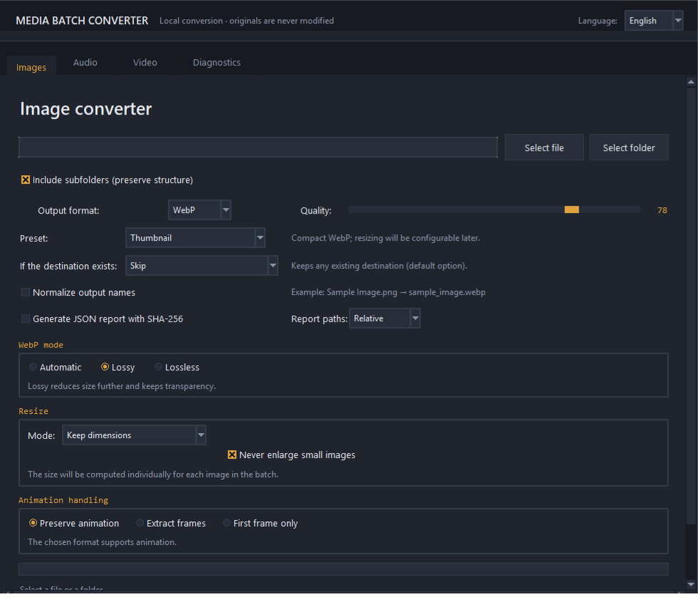
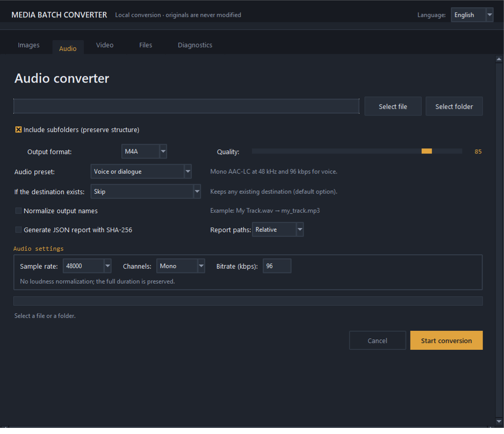
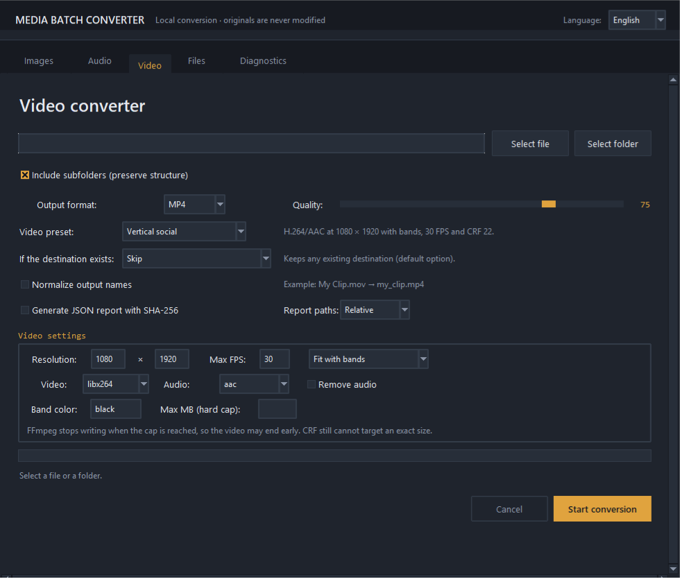
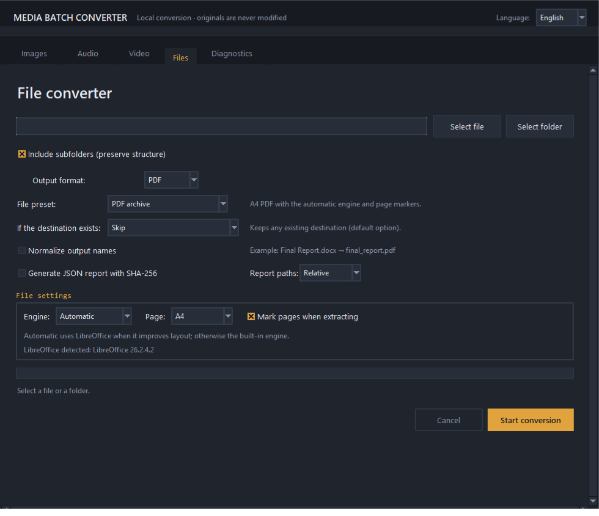

# Media Batch Converter

Desktop application for converting and optimizing images, audio, video, and documents individually or in batches. It is built with Python, Tkinter, Pillow, and FFmpeg, with an optional LibreOffice engine for high-fidelity office files.

## Screenshots

### Image conversion



### Audio conversion



### Video conversion



### File conversion



## Features

- Convert one file or entire folders, with optional recursive discovery and preserved subfolder structure.
- Convert common image, audio, video, and document formats from separate tabs.
- Choose WebP automatic, lossy, or lossless encoding.
- Apply image, audio, video, and file presets, then refine settings manually.
- Resize images proportionally while preserving transparency where the destination supports alpha.
- Create multi-resolution ICO favicons from logos and other images.
- Control video resolution, frame-rate limit, aspect handling, codecs, audio removal, CRF quality, and an optional hard size cap.
- Choose how existing outputs are handled: skip, safe overwrite, unique name, or overwrite only when newer.
- Keep both files when a batch would otherwise write two sources to the same destination name.
- Optionally normalize generated filenames without renaming originals. Windows reserved device names are always avoided.
- Generate privacy-aware JSON reports with chunked SHA-256 checksums.
- Preserve supported animations, extract frames, or explicitly keep only the first frame.
- Review validation warnings, progress, cancellation, and a final batch summary.
- Switch the interface between Spanish and English at any time from the language selector.
- Read dense settings comfortably in a dark, instrument-style interface built for long sessions.
- Process everything locally. No media is uploaded.

## Supported formats

| Media | Input and output formats |
| --- | --- |
| Images | PNG, JPG, WebP, ICO, BMP, TIFF, GIF |
| Audio | MP3, WAV, FLAC, OGG, M4A/AAC, Opus |
| Video | MP4, MKV, WebM, MOV, AVI |
| Files | PDF, DOCX, ODT, RTF, TXT, Markdown, HTML, XLSX, CSV, PPTX; DOC/XLS/PPT/ODP through LibreOffice |

Exact codec availability depends on the Pillow and FFmpeg builds in use. Transparency is retained for compatible image formats; JPEG uses a white background. Animated output is runtime-probed because codec support varies.

## Download and install on Windows

Download the ZIP attached to the relevant GitHub Release, verify its SHA-256 checksum, extract the complete folder, and run:

```text
MediaBatchConverter\MediaBatchConverter.exe
```

Keep the folder contents together: the executable uses the bundled FFmpeg and support files. Windows may show a reputation warning for an unsigned community build. Review the release source and checksum before running it.

No installer is currently provided. The application does not install dependencies or run `pip` automatically.

## Quick usage

1. Open the Images, Audio, Video, or Files tab.
2. Select one file or a source folder.
3. For folders, choose whether to include subfolders.
4. Select an output format and preset or manual settings.
5. Choose the existing-file policy and optional report settings.
6. Start conversion and review the final summary.

Outputs are created beside the sources in a `convertidos_<format>` directory. Existing `converted_*` and `convertidos_*` directories, symbolic links, and Windows directory junctions are excluded from recursive discovery. An empty output tree left by a failed or cancelled batch is removed.

### Examples

- Convert a transparent PNG to WebP: Images → select file → WebP → Automatic → Start.
- Create a favicon from a logo: Images → select a PNG or another image → ICO (favicon) → Start.
- Convert a recursive image tree: Images → select folder → keep Include subfolders enabled.
- Create an audio master: Audio → select source → WAV master preset.
- Create a compatible MP4: Video → select source → High quality 1080p preset.
- Convert a Word file to PDF: Files → select a DOCX → PDF archive preset → Start.
- Extract text from a PDF: Files → select a PDF → Plain text preset → Start.

## Interface

The interface is a dark graphite console with a single amber accent reserved for
the active path: the primary action, the selected tab, progress and focus. A
muted teal marks verified results. Numbers — quality, sizes, dimensions — are set
in a monospaced face so they line up and can be compared at a glance.

Everything visual is defined in `ui/theme.py`. Changing the palette there
restyles the whole application, including the summary window and the
diagnostics console.

## Screenshots

The images above are generated, not taken by hand:

```powershell
python tools/screenshot.py --all
```

The tool builds the application in-process, so the tab, language and preset are
chosen directly rather than by clicking, and every run produces the same image.
It captures with `PrintWindow`, which asks the window to draw itself into an
offscreen bitmap: nothing else on the desktop can end up in the picture and the
window does not need to be in front. Settings are redirected to a temporary
folder, so running it never disturbs your own preferences.

Single captures accept a tab, a language and a preset:

```powershell
python tools/screenshot.py --tab video --language es --preset webm_vp9 --output shot.png
```

`--scaling` renders the interface as a high-DPI user sees it, which is useful to
check the layout at 150% or 200%. It enlarges the interface, not the image: the
capture is the window's real pixels, so its resolution is capped by the display.
Native dialogs and open dropdowns are separate windows and do not appear.

## Language

The interface ships in Spanish and English. Pick one from the **Idioma / Language**
selector at the top right of the window; the change applies immediately, without
restarting.

The choice is stored with the rest of the local settings and restored on the next
launch. Spanish is the default. Everything the user reads follows the selection:
tabs, controls, presets, validation warnings, progress status, batch summaries,
error messages and the text inside JSON reports. The stable `code` field of each
report warning does not change with the language, so reports stay machine-readable
either way.

Switching rebuilds the tabs, so the currently selected file or folder is cleared;
presets and output policy are preserved because they are persisted. The selector
is refused while a conversion is running. Closing the window during a batch asks
for confirmation and cancels the encoder.

To add another language, copy `locales/es.py`, translate the values, and register
the module in `i18n.py`. `tests/test_i18n.py` fails if a catalogue is missing a
key or a format placeholder, so gaps surface immediately.

## Image behavior

### Favicons

ICO output preserves transparency and embeds the standard 16, 24, 32, 48, 64, 128, and 256 px square sizes supported by the source dimensions. Square source images are recommended for predictable browser results.

### WebP modes

- Automatic selects lossless for animations, palette images, and sampled images with at most 256 colors; it otherwise uses lossy encoding.
- Lossy uses the quality slider while retaining alpha support.
- Lossless preserves pixel values and ignores the quality slider.

### Resizing

Available modes preserve dimensions, limit width, limit height, fit within a box, or scale by percentage. Resizing uses LANCZOS after EXIF orientation, preserves aspect ratio and transparency, and does not crop or apply AI upscaling. Targets are limited to 16 384 pixels per side.

### Animated images

For animated sources, choose to preserve the animation, extract numbered frames, or keep the first frame. Preservation retains frame order, duration, loop, transparency, and disposal as far as Pillow and the destination codec allow. Unsupported animated destinations fail explicitly rather than silently discarding frames. Animations with more than 500 frames cannot be preserved or extracted in one go; use First frame only or split the file. Extracting frames follows the same existing-file policy as other outputs.

## Document behavior

The Files tab converts through a shared intermediate model, so a new format is one reader or writer rather than a new pair for every existing type. The built-in engine reconstructs text, headings, lists, tables, embedded images and header or footer text from Word `.docx` files, and pictures from PowerPoint `.pptx` files. It does not clone the original page geometry. Password-protected files fail explicitly. Spreadsheet exports neutralize formula-like cells so opening the result does not execute injected formulas.

LibreOffice, when installed, is an optional high-fidelity engine for Office binaries (DOC, XLS, PPT), ODF and layout-sensitive pairs such as DOCX → PDF. It is resolved the same way as FFmpeg: never downloaded, never invoked through a shell, isolated with a temporary user profile, and subject to a timeout. HTML conversions keep companion image files next to the document. The whole LibreOffice process tree is stopped on cancel or timeout. Set `LIBREOFFICE_PATH` to point at `soffice.exe` if the usual install locations are not used.

Sources are sniffed by magic bytes. Office packages are checked for zip bombs, member-count limits and unsafe paths. Empty files, symlinks and extension mismatches are rejected before a reader opens them. Oversized embedded images are skipped instead of aborting the whole document.

## Presets and output safety

Image presets cover high-quality illustration, general mobile assets, large backgrounds, transparent UI assets, thumbnails, and lossless archives. Audio presets cover playback music, ambience, effects, WAV masters, and voice. Video presets cover 720p, 1080p, vertical social output, horizontal trailers, and VP9 WebM.

Manual edits switch a preset to Custom. Preset state is stored locally.

Existing outputs can be skipped, atomically overwritten, given a deterministic suffix, or replaced only when the source is newer. A failed conversion does not replace an existing destination. Originals are never modified, renamed, or deleted. If several sources in the same batch would share one destination name (`Photo.png` and `Photo.jpg` both becoming `Photo.webp`), both are kept with a `_2` suffix instead of skipping or overwriting one.

Filename normalization is optional. It converts generated basenames to bounded lowercase ASCII identifiers. Windows reserved device names such as `CON` and `NUL` are rewritten even when normalization is off. Collision handling still applies after normalization.

## JSON reports and SHA-256

Optional reports record public settings, final resolved output paths, per-file status, warnings, sizes, and SHA-256 for successful outputs. Hashing is streamed in 1 MiB chunks and supports cancellation. Relative paths are the default; absolute paths require explicit selection. Report writes are atomic, never overwrite an earlier report, and work on NTFS as well as FAT/exFAT and typical cloud-synced folders.

## FFmpeg behavior

FFmpeg is resolved in this order:

1. The packaged `ffmpeg` directory.
2. The executable provided by `imageio-ffmpeg`.
3. An `ffmpeg` command on `PATH`.

Images remain available when FFmpeg is missing; audio and video tabs are disabled. The Files tab stays available with the built-in engine; it is disabled only when the document libraries themselves are missing. The Diagnostics tab shows the selected FFmpeg provider, LibreOffice if present, and anonymized paths. FFmpeg and LibreOffice processes are cancellable: cancel terminates the encoder and kills it if it does not exit, including LibreOffice child processes. Partial temporary outputs are cleaned up. Fill and stretch video sizes are forced to even dimensions for `yuv420p`. An optional Max MB field is a hard FFmpeg write cap and may end the video early.

## Run from source

Requirements: Windows, Python 3.12 with Tcl/Tk, and Git.

```powershell
git clone https://github.com/JoanOliver04/media-batch-converter.git
cd media-batch-converter
py -3.12 -m venv .venv
.venv\Scripts\python -m pip install -r requirements.txt
.venv\Scripts\python run_app.py
```

For development tools:

```powershell
.venv\Scripts\python -m pip install -r requirements-dev.txt
```

## Build the Windows executable

```bat
build_windows.bat
```

The script creates an isolated `.build-venv`, installs pinned dependencies, runs the full test suite, generates Windows version metadata from `version.py`, and builds a one-folder distribution with PyInstaller. Expected output:

```text
dist\MediaBatchConverter\MediaBatchConverter.exe
```

The build bundles the FFmpeg executable supplied by `imageio-ffmpeg`. See [Third-party notices](THIRD_PARTY_NOTICES.md) before redistribution.

## Testing and quality checks

```powershell
python -m ruff format --check .
python -m ruff check .
python -m unittest discover -s tests -q
```

Tests cover pure calculations, error and collision policies, recursive batches, reports, image transparency and animation, Unicode audio paths, video without audio, packaged resource resolution, accessibility scaling, catalogue consistency and language switching, document security checks, and integration combinations.

## Project structure

```text
run_app.py                    Safe launcher and dependency checks
tools/screenshot.py           Reproducible application screenshots
i18n.py                       Active language and message lookup
locales/                      One message catalogue per language (es, en)
ui/                           Tkinter presentation layer
  app.py                      Main window, tabs, and entry point
  base.py                     Shared controls, batch flow, and reporting
  ffmpeg_panel.py             Shared FFmpeg process and batch handling
  image_panel.py              Image tab and image batch conversion
  audio_panel.py              Audio tab
  video_panel.py              Video tab
  formats.py                  Supported formats and output path resolution
  theme.py                    Palette, typography and ttk styling
  widgets.py                  Scrollable tab viewport
  diagnostics.py              Diagnostics tab
  document_panel.py           Files tab
documents/                    Document conversion package
  conversion.py               Engine choice and one-file orchestration
  formats.py                  Conversion matrix
  security.py                 Type sniffing and zip-bomb limits
  textio.py / pdfio.py / office.py  Built-in readers and writers
  libreoffice.py              Optional high-fidelity engine
batch_processing.py          Recursive discovery
process_control.py           Encoding-safe subprocess helpers and shutdown
conversion_results.py        Shared result and summary models
conversion_report.py         JSON reports and streamed checksums
image_*.py / webp_encoding.py Image services and validation
audio_encoding.py            Audio settings and FFmpeg arguments
video_encoding.py            Video settings, arguments, and progress
runtime_environment.py       Dependency and packaged-resource resolution
version.py                   Public name and version source
tests/                       Automated test suite
```

Audio and video share `FFmpegPanel` rather than one inheriting from the other. Code identifiers and documentation are English; user-facing text lives in `locales/`, never inline in the modules, and every color and font comes from `ui/theme.py`.

## Troubleshooting

- Pillow missing: activate the intended environment and run `python -m pip install -r requirements.txt`.
- Audio or video disabled: install project dependencies or place a working FFmpeg on `PATH`, then restart.
- Codec unavailable: inspect the Diagnostics tab and choose a format supported by that FFmpeg build.
- Tkinter unavailable: reinstall official Python for Windows with Tcl/Tk enabled.
- Permission or disk-space error: choose a writable source location with enough free space.
- Detailed failures: inspect the rotating local log path shown in Diagnostics. Normal dialogs omit stack traces.

## Privacy

All processing is local. Files are not uploaded, and the application has no network conversion service. Originals are not modified or deleted. JSON reports use relative paths by default, and copied diagnostics anonymize the user-home directory.

## Limitations

- Only Spanish and English are available; other languages need a new catalogue.
- Windows is the tested packaged target; source execution elsewhere is not guaranteed.
- Release binaries are not code-signed.
- FFmpeg codec support and patent considerations vary by build and jurisdiction.
- Metadata and ICC preservation depend on the selected format and are intentionally limited for some image outputs.
- CRF video output cannot guarantee an exact final file size. The optional Max MB field is a hard write cap and may cut the video short.
- Animations longer than 500 frames cannot be preserved or extracted in a single conversion.
- No installer or automatic updater is provided.

## Contributing and security

Read [CONTRIBUTING.md](CONTRIBUTING.md) before proposing a change. Use the issue templates for reproducible bugs and focused feature requests. Report vulnerabilities through the process in [SECURITY.md](SECURITY.md), not a public issue.

## Release process

The complete release checklist is in [RELEASING.md](RELEASING.md). Releases follow Semantic Versioning. The latest published release is **0.2.1**. Hardening after that release is documented under Unreleased in [CHANGELOG.md](CHANGELOG.md).

Suggested repository topics: `python`, `tkinter`, `pillow`, `ffmpeg`, `image-converter`, `audio-converter`, `video-converter`, `batch-processing`, `webp`, `desktop-app`, `media-tools`.

## Roadmap

Potential future work includes localization, signed builds, an installer, configurable output roots, more packaged-platform testing, and optional hardware-encoding profiles. Roadmap items are not commitments.

## License

Project source code is available under the [MIT License](LICENSE). Dependencies and bundled FFmpeg remain under their own licenses; consult [THIRD_PARTY_NOTICES.md](THIRD_PARTY_NOTICES.md). No legal guarantee is provided.
